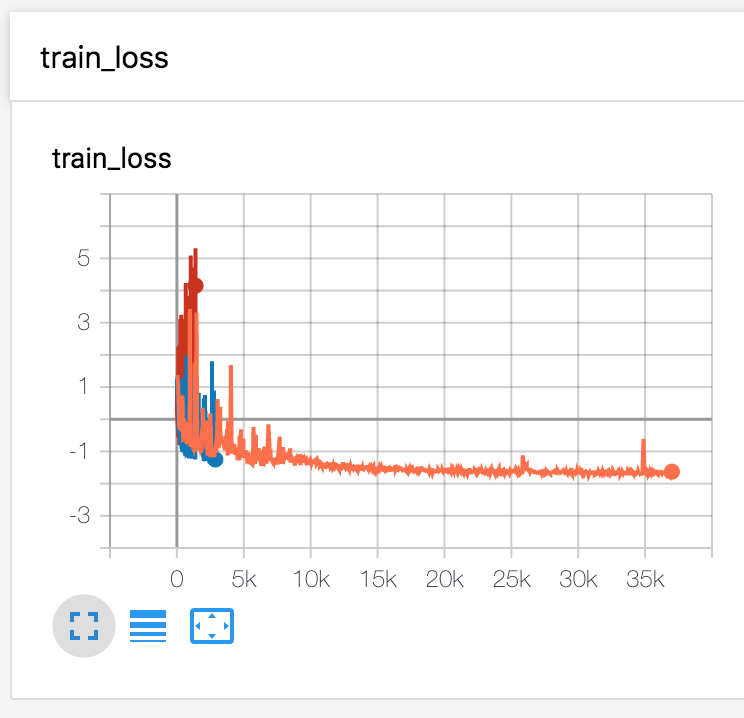

# MelNet (WIP)

Implementation of [MelNet: A Generative Model for Audio in the Frequency Domain](<https://arxiv.org/abs/1906.01083>) (Work in progress)

## Prerequisites

- Tested with Python 3.6.8, PyTorch 1.2.0.
- `pip install -r requirements.txt`

## How to train

- Download train data: You may use either Blizzard(22,050Hz) or VoxCeleb2(16,000Hz) data. Both `m4a`, `wav` extension can be used. 
  - For `wav` extension, you need to fix `datasets/wavloader.py#L38`. This hardcoded file extension will be fixed soon.
- `python trainer.py -c config/voxceleb2.yaml -n [name of run] -t [tier number] -b [batch size]`
  - You may need to adjust the batch size for each tier. For Tesla V100(32GB), b=4 for t=1, b=8 for t=2 was tested. 
  - We found that only SGD optimizer with `lr=0.0001, momentum=0` works properly. Other optimizers like RMSProp or Adam have lead to severe unstability of loss. 

## To-do

- [x] Implement upsampling procedure
- [x] GMM sampling + loss function
- [ ] Unconditional audio generation
- [ ] TTS synthesis (PR [#3](<https://github.com/Deepest-Project/MelNet/pull/3>) is in review)
- [x] Tensorboard logging
- [ ] Multi-GPU training

## Implementation authors

- [Seungwon Park](<https://github.com/seungwonpark>), [June Young Yi](<https://github.com/Rick-McCoy>), [Yoonhyung Lee](<https://github.com/LEEYOONHYUNG>), [Joowhan Song](<https://github.com/Joovvhan>) @ Deepest Season 6

## License

MIT License
